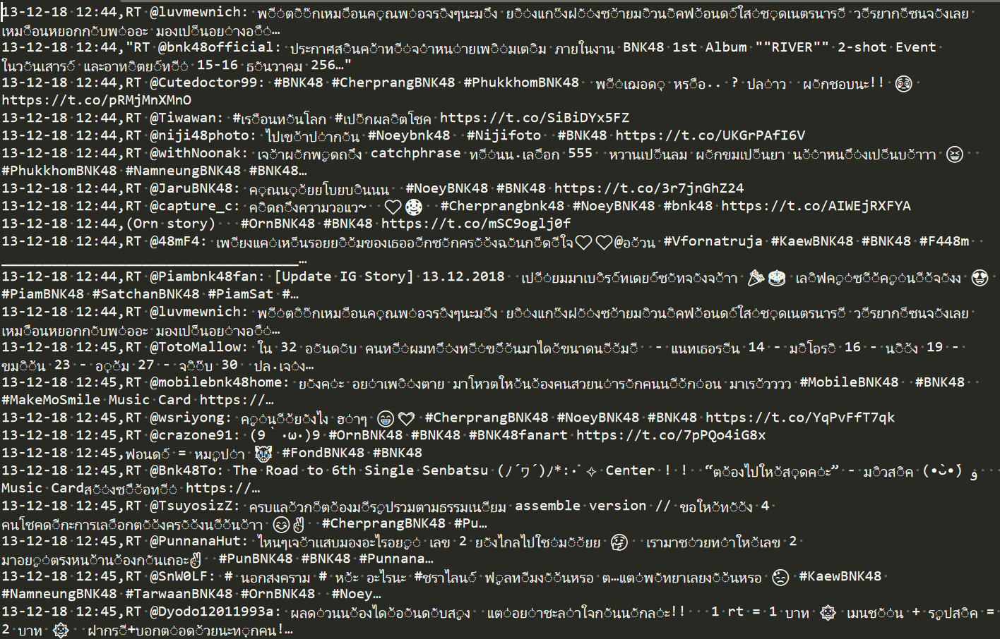

# Hashtag-BNK48

ศึกษาและวิเคราะห์ข้อมูล # ในทวิตเตอร์ว่า เมมเบอร์คนใหนใน BNK48 ถูกกล่าวถึงมากที่สุด ในช่วงหนึ่งอาทิตย์ (7-14 ธันวาคม 2561)


### Requirement
โปรแกรมและ Module ที่ใช้
```
Python3
Tweepy
Pygal
Pandas
```

### เริ่มต้นกันเลย

ก่อนอื่นเรามาเรื่มรันตัว Streaming script ของเรากันก่อนเลย
เราเริ่มต้นโดยการรัน streamingTwitter.py กันก่อน
```
# Import modules
import tweepy
import json
import csv

class MyStreamListener(tweepy.StreamListener):

    def on_status(self, tweet):
        """ Import streaming text to CSV """
        with open('bnkdata.csv', 'a', encoding='utf-8',  newline='') as writeFile:
            payload = [tweet.created_at, tweet.text.replace('\n', ' ')]
            writer = csv.writer(writeFile)
            writer.writerow(payload)
            print(sum(1 for line in csv.reader( open('bnkdata.csv', 'r', encoding='utf-8'))))

def main ():
    """ Create credential variables"""
    consumer_key = 'your_consumer_key'        # put your consumer_key from Twitter API
    consumer_secret = 'your_consumer_secret'  # put your consumer_secret from Twitter API
    access_token = 'your_access_token'        # put your access_token from Twitter API
    access_secret = 'your_access_secret'      # put your access_secret from Twitter API

    auth = tweepy.OAuthHandler(consumer_key, consumer_secret)
    auth.set_access_token(access_token, access_secret)

    api = tweepy.API(auth)

    myStreamListener = MyStreamListener()
    myStream = tweepy.Stream(auth = api.auth, listener=myStreamListener)
    myStream.filter(track=['#BNK48'])

main()

```
โดยจะต้องใส่ Key API ของ Twitter ลงไปด้วย ทางเราไม่สามารถ TT

หลังรันไปสักพัก เราจะเห็นตัวเลขขึ้นมามากมาย นั่นหมายถึงจำนวนข้อมูลที่เรา Stream มาได้นะจ้ะ


หลังจากทำการ Run จนได้ข้อมูลเท่าทีเราต้องการเราก็จะได้ file ที่ชื่อว่า bnkdata.csv ข้อมูลที่ได้ก็จะมีหน้าตาประมาณนี้



หลังจากเราได้ข้อมูล เรามาเริ่มจัดการข้อมูลกันเลยดีกว่า
เริ่มจากอย่างแรกเราก็ต้องเรียกข้อมูลออกมาใช้ก่อนเลย
```
import csv
def main(tweets, member_dict):
    """
    This is the function that ties every function to work together
    """
    with open('bnkdata.csv', encoding='utf-8') as csvfile:
```
หลังจากนี้เราก็สามารถเรียกใช้ข้อมูลได้แล้วหล่ะ หลังจากนั้นเราก็จัดการข้อมูลซะเลย
เนื่องจากข้อมูลประเภท CSV จะถูกคั่นด้วย ',' เราจึงแบ่งแค่ส่วนที่เป็นข้อความมาใช้ โดยที่เราจะเชคว่าเป็น Retweet หรือไม่ ถ้าเป็นเราจะไม่นำข้อมูลมาใช้ครับ
```
for data in csvfile:
            data = data.split(',')
            if removeRT(data[1]) != None: # Check if data is not None
                tweets = removeRT(data[1])
def removeRT(tweet):
    """
    Remove the data if data is a retweets
    """
    if "RT" not in tweet[0:3]:
        return tweet.lower()
```
หลังจากเราเช็คว่าข้อมูลเป็น Retweets แล้ว เราก็จะมาแยก # แล้วมาจัดเก็บข้อมูลลงใน dict กันและเช็คข้อมูลด้วยว่าเป็น # ของ member BNK48 หรือไม่
```
import re
if count_hashtags(tweets) != None: # Check Hashtags
    for hashtag in count_hashtags(tweets):
        if hashtag not in member_dict:
            member_dict[hashtag] = 1
        else:
            member_dict[hashtag] += 1
member_dict = filter_member_data(member_dict)
def count_hashtags(tweet):
    """
    Check how many tweet with members hashtags
    """
    hashtags = (re.findall(r"\B(\#[a-zA-Z0-9]+\b)(?!;)", tweet))
    if check_hashtags(hashtags) != []:
        return check_hashtags(hashtags)
def check_hashtags(hashtags):
    """ Check if hashtag include BNK48"""
    payload = []
    for hashtag in hashtags:
        if hashtag[-5:] == 'bnk48' and hashtag != '#bnk48':
            payload.append(hashtag)
    return payload
def  filter_member_data(data):
    """ """
    member_dict = {}
    member_list = ['#mobilebnk48', '#cherprangbnk48', '#weebnk48', '#kaewbnk48','#noeybnk48','#ornbnk48', \
    '#fondbnk48', '#punbnk48', '#mewnichbnk48', '#jennisbnk48', '#musicbnk48', '#myyubnk48', '#satchanbnk48', \
    '#kornbnk48', '#kaimookbnk48', '#janebnk48', '#jibbnk48', '#mindbnk48', '#oombnk48', '#mioribnk48', '#pupebnk48', \
    '#nikybnk48', '#newbnk48', '#namneungbnk48', '#junebnk48', '#izurinabnk48', '#natherinebnk48', '#viewbnk48', \
    '#tarwaanbnk48', '#minminbnk48', '#cakebnk48', '#aombnk48', '#ratahbnk48', '#phukkhombnk48', '#khaminbnk48', \
    '#stangbnk48', '#pandabnk48', '#ninebnk48', '#namsaibnk48', '#khengbnk48', '#fifabnk48', '#faiibnk48', '#jaabnk48', \
    '#piambnk48', '#mairabnk48', '#deeneebnk48', '#gygeebnk48', '#pakwanbnk48', '#bamboobnk48', '#ninkbnk48', '#katebnk48']
    for hashtag in data:
        if hashtag in member_list:
            member_dict[hashtag] = data[hashtag]
    return member_dict
```
หลังจากแยกข้อมูลและจำนวน hashtag ออกหมดแล้ว เรามาเรียงลำดับข้อมูลกันดีกว่า
```
member_dict = sort_members_data(member_dict)
def sort_members_data(data):
    """
    Sort member data
    """
    sort_data = sorted((value, key) for (key,value) in data.items())
    members = {}
    for member in sort_data[::-1]:
        members[member[1]] = member[0]
    return members
```
หลังจากเรียงลำดับข้อมูลเสร็จ เราก็พร้อมจะนำข้อมูลมาทำเป็นกราฟกันได้แล้วโดยใช้ pygal
```
import pygal as pg
    chart_horizontal = pygal_horizontal(member_dict)
    chart_pie = pygal_pie(member_dict)
    chart_horizontal.render_to_file('BNK48graph top 7.svg')
    chart_pie.render_to_file('BNK48graph all member.svg')
def pygal_horizontal(data):
    """made horizontal chart"""
    data_tuple = sorted(data.items() , reverse=True, key=lambda x: x[1])
    line_chart = pg.HorizontalBar()
    line_chart.title = 'Top 7 BNK48 member'
    for i in range(0,7):
        line_chart.add(data_tuple[i][0], data_tuple[i][1])
    return line_chart
def pygal_pie(data):
    """made pie chart"""
    data_tuple = sorted(data.items() , reverse=True, key=lambda x: x[1])
    pie_chart = pg.Pie()
    pie_chart.title = 'All BNK48 member #hashtag'
    for i in range(0,51):
        pie_chart.add(data_tuple[i][0], data_tuple[i][1])
    return pie_chart
```
หลังจากการ run และ render ออกมาแล้วก็จะได้ไฟล์ SVG ดังนี้


โดย ที่มีคนพูดถึงมากที่สุดในช่วงประกาศผลด่วนเลือกตั้งได้แก่น้องโมบายล์นั่นเอง !!!
<div style="text-align:center"></div>

เสร็จสิ้นกันเรียบร้อยสำหรับการ Streaming ข้อมูลจากใน Twitter แล้วนำมาใช้เป็น Plot เป็นกราฟโดยใช้ pygal
หวังว่าโปรเจคที่จัดทำขึ้นนี้ จะเป็นประโยชน์ต่อใครที่กำลังศึกษาการ Datamining และ การใช้ Python ไม่มากก็น้อย

### คณะผู้จัดทำ

|||||
|:-----:|:-----:|:-----:|:-----:|
|[nanapoou](https://github.com/nanapoou)|[Paweennuch](https://github.com/Paweennuch)|[SuraweeTedsakorn](https://github.com/SuraweeTedsakorn)|[chastiefol](https://github.com/chastiefol)|

- นาย นายนวภูมิ แก้วมณี 61070102
- นางสาว ปวีณนุช ตุ้ยใหม่ 61070120
- นาย นายสุรวีร์ เทศกรณ์ 61070252
- นาย กันต์ วงษ์อุบล 61070337
