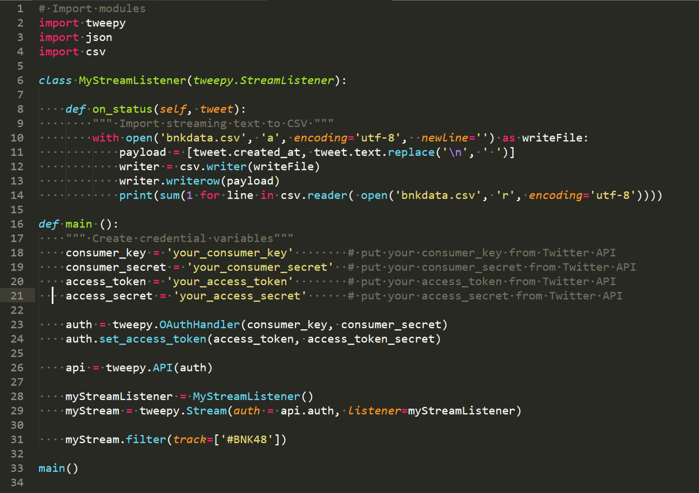
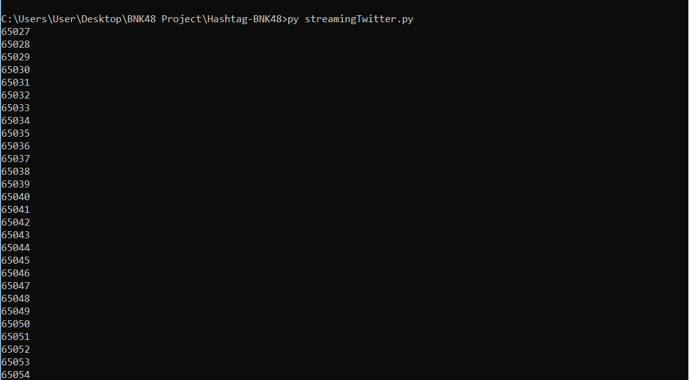

# Hashtag-BNK48

ศึกษาและวิเคราะห์ข้อมูล # ในทวิตเตอร์ว่า เมมเบอร์คนใหนใน BNK48 ถูกกล่าวถึงมากที่สุด ในช่วงหนึ่งอาทิตย์ (7-14 ธันวาคม 2561)


### Requirement
โปรแกรมและ Module ที่ใช้
```
Python3
Tweepy
Pandas
Pygal
```

### เริ่มต้นกันเลย

ก่อนอื่นเรามาเรื่มรันตัว Streaming script ของเรากันก่อนเลย
เราเริ่มต้นโดยการรัน streamingTwitter.py กันก่อน

โดยจะต้องใส่ Key API ของ Twitter ลงไปเองนะจ้ะ ทางเราให้ไม่ได้ TT

หลังรันไปสักพัก เราจะเห็นตัวเลขขึ้นมามากมาย นั่นหมายถึงจำนวนข้อมูลที่เรา Stream มาได้นะจ้ะ

รูปที่แคปมาคือรันต่อจากไฟล์อันเก่านะจ้ะ มันเลยเป็น 6 หมื่นกว่าข้อมูล

## Contributing


#### รายชื่อสมาชิก
- นาย นายนวภูมิ แก้วมณี [61070102](https://github.com/nanapoou)
- นางสาว ปวีณนุช ตุ้ยใหม่ [61070120](https://github.com/Paweennuch)
- นาย นายสุรวีร์ เทศกรณ์ [61070252](https://github.com/SuraweeTedsakorn)
- นาย กันต์ วงษ์อุบล [61070337](https://github.com/chastiefol)
